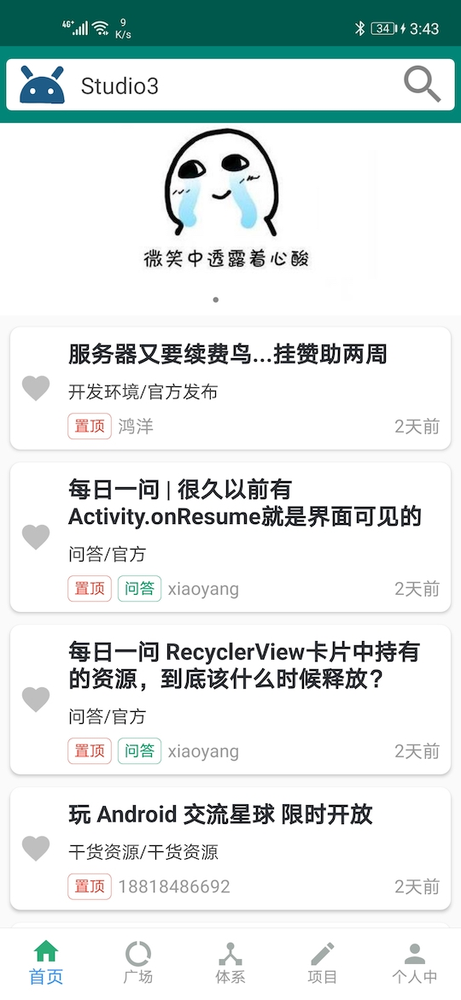
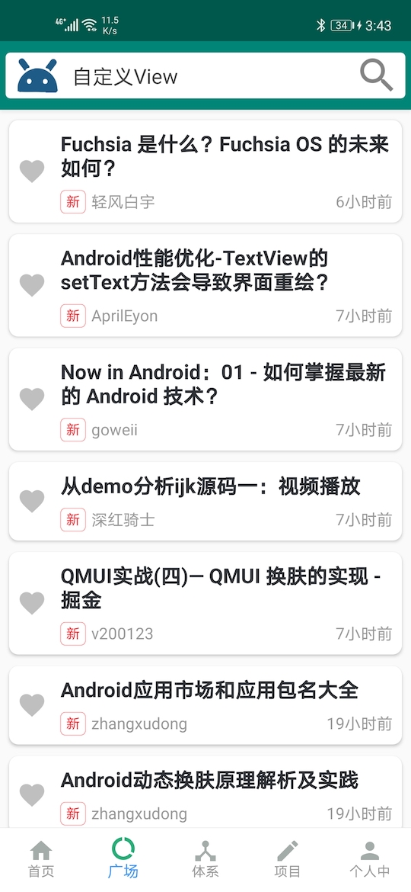
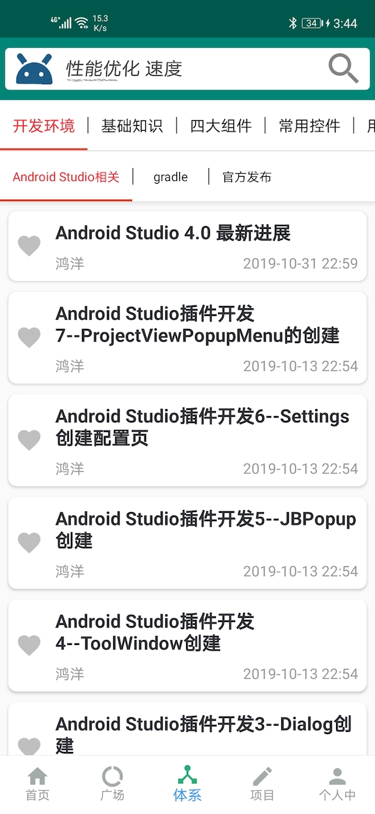
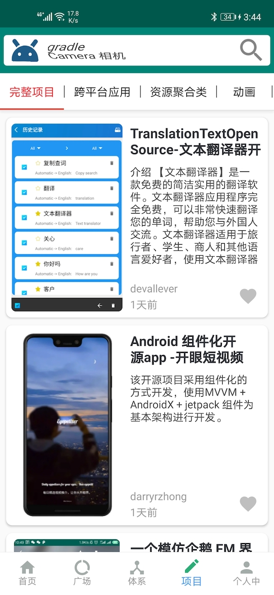
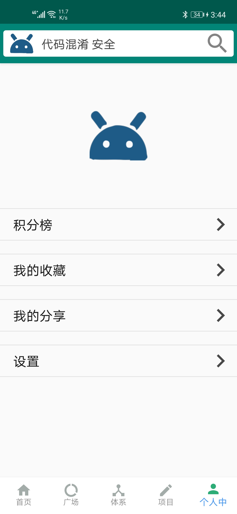
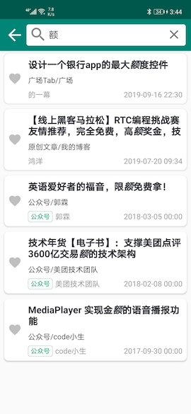
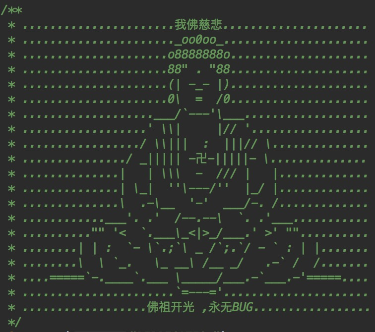

# WanAndroid • kotlin 版本
基于[www.wanandroid.com](https://www.wanandroid.com/)开发App，主要包括首页、广场、体系、项目、我的、搜索等6大模块，第一版主要是练手，界面比较粗糙

项目采用模块化开发，也是为了整理框架

分为base库、网络库、工具库、自动化生成代码工具等

持续更新中...

项目地址：[https://github.com/qiduzao/WanAndroid-Kotlin](https://github.com/qiduzao/WanAndroid-Kotlin)

### 效果图
&nbsp;&nbsp; &nbsp;&nbsp; 

&nbsp;&nbsp; &nbsp;&nbsp; 

### 使用到的依赖库

* 项目框架：MVVM + Jetpack
* 网络框架：okhttp3 + retrofit2 + rxjava2
* 图片框架：glide
* banner：com.youth.banner.Banner
* recycleview刷新加载：com.scwang.smart:refresh-layout-kernel
* webview：com.just.agentweb:agentweb
* 底部切换button：com.ashokvarma.android:bottom-navigation-bar

